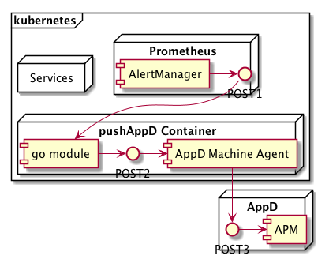
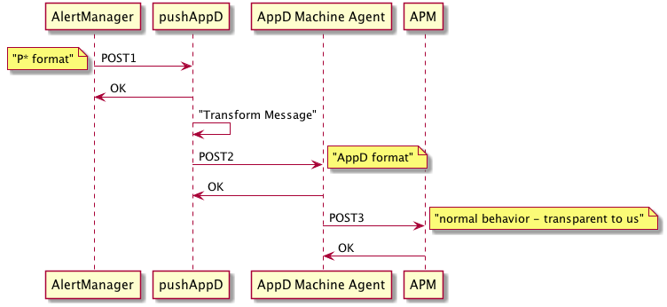

# Prometheus AlertManager to AppD APM Webhook

## Work in Progress

## Problem Statement

We have a support team that does L1 support for a huge range of legacy, brown field and green field software solutions.  They use AppDynamics (AppD) across the whole portfolio.  The cutting edge of our green field efforts is services deployed in kubernetes (k8s) monitored by Prometheus (P*).  Since AppD lacks a cloud API to push alerts to it, we need to "bridge" Alerts from Prometheus into an AppD APM running outside k8s.  

## Solution Summary

This solution - which we are calling "pushAppD" - is a small custom golang module to receive the Prometeus POST, transform the format, and then POST the solution to APM.  This will be packaged as a k8s service.  The pod definition for this service will include the relatively heavy AppD Machine Agent as well as this module.  When deployed into k8s it will be a highly available service to bridge Prometheus Alerts into AppD.

## Deployment Model

### Block Diagram




### Sequence Diagram




### Theory of Operation

This effort aims to take configured alert flow from Prometheus AlertManager and forward it on to Application Dynamics (AppD) APM for further processing.

On the Prometheus side, this will be done through the [webhook method](https://prometheus.io/docs/alerting/configuration/#webhook_config).  Specifically:

Whether or not to notify about resolved alerts.  

```
[ send_resolved: <boolean> | default = true ]
```
The endpoint to send HTTP POST requests to.  This will be the pushAppD service URL.  

```
url: <string>
```
The Alertmanager will send HTTP POST requests in the following JSON format to the configured endpoint:  

```
{
  "version": "4",
  "groupKey": <string>,    // key identifying the group of alerts (e.g. to deduplicate)
  "status": "<resolved|firing>",
  "receiver": <string>,
  "groupLabels": <object>,
  "commonLabels": <object>,
  "commonAnnotations": <object>,
  "externalURL": <string>,  // backlink to the Alertmanager.
  "alerts": [
    {
      "status": "<resolved|firing>",
      "labels": <object>,
      "annotations": <object>,
      "startsAt": "<rfc3339>",
      "endsAt": "<rfc3339>",
      "generatorURL": <string> // identifies the entity that caused the alert
    },
    ...
  ]
}
```

The pushAppD service will transform the ALERT into an EVENT and deliver it to the local Machine Agent via POST.
We do this because the AppD APM does not expose a cloud API, the only way to get alerts into APM is via the [Standalone Machine Agent HTTP Listener](https://docs.appdynamics.com/display/PRO44/Standalone+Machine+Agent+HTTP+Listener) "Create Events" API.  Specifically:

```
POST /api/v1/events  
[
  {
    "eventSeverity": <event_severity>,
    "type": "<event_type>",
    "summaryMessage": "<event_summary>",
    "properties": {
      "<key>": {
        <user-specified_object>
      },...
    },
    "details": {
      "<key>": "<value>"
    }
  },
  {
    "eventSeverity": <event_severity>,
    "type": "<event_type>",
    "summaryMessage": "event_summary>",
    "properties": {
      "<key>": {
        <user-specified_object>
      },...
    },
    "details": {
      "<key>": "<value>"
    }
  },...
]
```

## Message Mapping

WORK TO BE DONE!  We must make a list of the ALERTS coming from P* and "map" them to EVENTS we want to send to AppD.

Prometheus ALERT (called POST1):

```
{
  "version": "4",
  "groupKey": <string>,    // key identifying the group of alerts (e.g. to deduplicate)
  "status": "<resolved|firing>",
  "receiver": <string>,
  "groupLabels": <object>,
  "commonLabels": <object>,
  "commonAnnotations": <object>,
  "externalURL": <string>,  // backlink to the Alertmanager.
  "alerts": [
    {
      "status": "<resolved|firing>",
      "labels": <object>,
      "annotations": <object>,
      "startsAt": "<rfc3339>",
      "endsAt": "<rfc3339>",
      "generatorURL": <string> // identifies the entity that caused the alert
    },
    ...
  ]
}
```

Machine Agent EVENT (called POST2):

```
POST /api/v1/events  
[
  {
    "eventSeverity": <event_severity>,
    "type": "<event_type>",
    "summaryMessage": "<event_summary>",
    "properties": {
      "<key>": {
        <user-specified_object>
      },...
    },
    "details": {
      "<key>": "<value>"
    }
  }]
```


Note that the Machine Agenet will POST all events to the AppD APM just like usual.  The Machine Agent must be properly configured to point to the APM backend.  These actions we call POST3 and they are opaque to us.  We are using the Local Machine Agent only for transport into APM.

## Contributing Documentation

If you want to edit and contribute, clone the repo locally and then you can edit the markdown as usual, or edit the diagrams in [plantuml](http://plantuml.com/) format embedded into Markdown files.  We recommend using Visual Studio Code (free) with the [jebbs plantuml](https://marketplace.visualstudio.com/items?itemName=jebbs.plantuml) extension.  You can then preview your edits live.  

The Makefile does the tricky parts – sorry, only works on a Mac.  Untested on windoze.  Just do a “make install” once to install the needed tools and then after your edits do “make” and you should get everything happy.  The Makefile will use the tooling you installed to convert the plantuml markdown files into vanilla puml files and then into png files that are used in the main markdown files.  This trickery would not be needed if GitHub would support plantuml natively!

