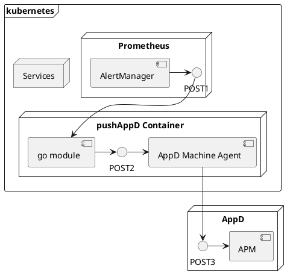

```plantuml
@startuml

frame "kubernetes" {
   
   node "Services" {
     
   }
   
   node "Prometheus" {
     [AlertManager] -> POST1   
   }  
 
   node "pushAppD Container" {
     [go module]  -> POST2
     POST2 -> [AppD Machine Agent]
    }
}
node "AppD" {
  POST3 -> [APM ]
 } 

POST1 --> [go module] 
[AppD Machine Agent] --> [POST3] 
@enduml
```