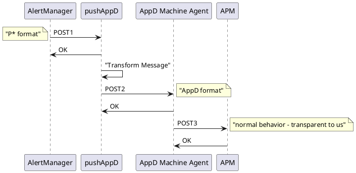

```plantuml
@startuml
AlertManager -> pushAppD : POST1
note left: "P* format"
pushAppD -> AlertManager : OK

pushAppD -> pushAppD : "Transform Message"

pushAppD -> "AppD Machine Agent" : POST2
note right: "AppD format"

"AppD Machine Agent" -> pushAppD : OK

"AppD Machine Agent" -> APM: POST3
note right: "normal behavior - transparent to us"
APM ->  "AppD Machine Agent" : OK
@enduml
```